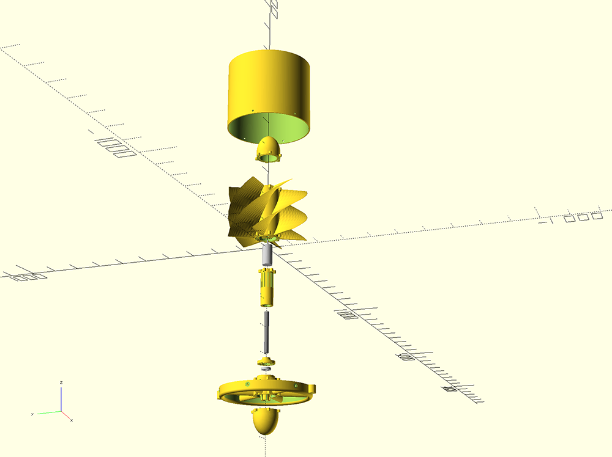
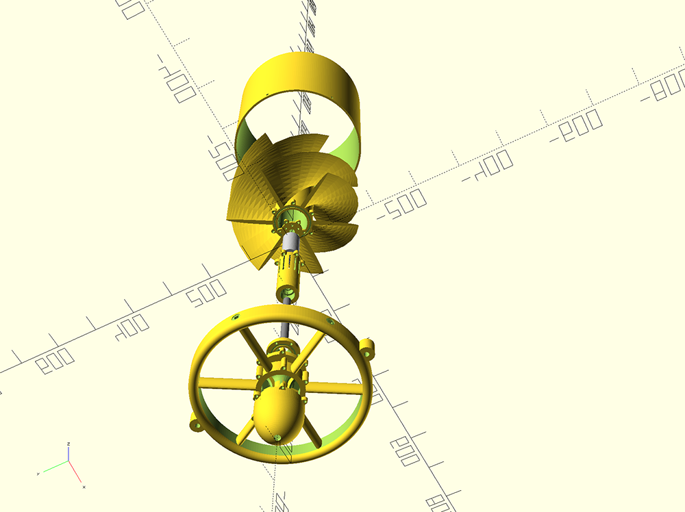

# The Walrus Turbine Procedural Engine

WalrusTurbine is a procedural engine for making mostly 3D printable mobile hydroelectric power generators.  

## Getting Started

### Prerequisites

The project is written in [OpenSCAD](http://www.openscad.org/).

### Installing

1. Put all .scad files in the same directory.
2. Open [assembly.scad](assembly.scad) in OpenSCAD to see the full assembled model.
3. Set the explode flag to 1, save, and have a look around. This may be just a wee bit taxing on your machine...

## Physical Assembly

The Walrus Turbine Procedural Engine was used create a denomstration model called the WT400. The WT400 is design to be printed on a printer with at least 400 mm build volume in all axis.

### Building a WT400
* [List of the non 3d printable parts and where to buy them.](WT400/parts-list.md)
* [Super rudimentary instructions.](WT400/instructions.md)

A lot more docs are coming soon so stay tuned.

## Contributing

Anyone who wants to contribute anything from openSCAD improvements to better assembly instructions is more than welcome.

## Authors

* **John Roper** 
* **Peter Brussard**

## License

This project is licensed under the MIT License - see the [license.txt](license.txt) file for details
