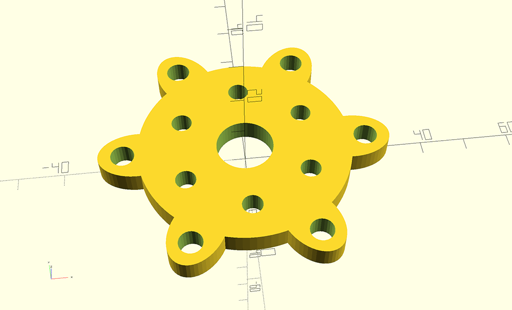
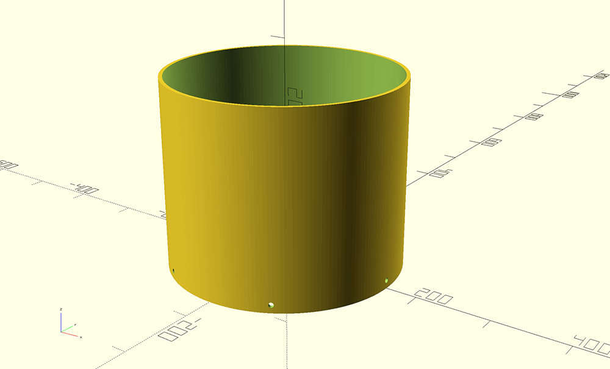
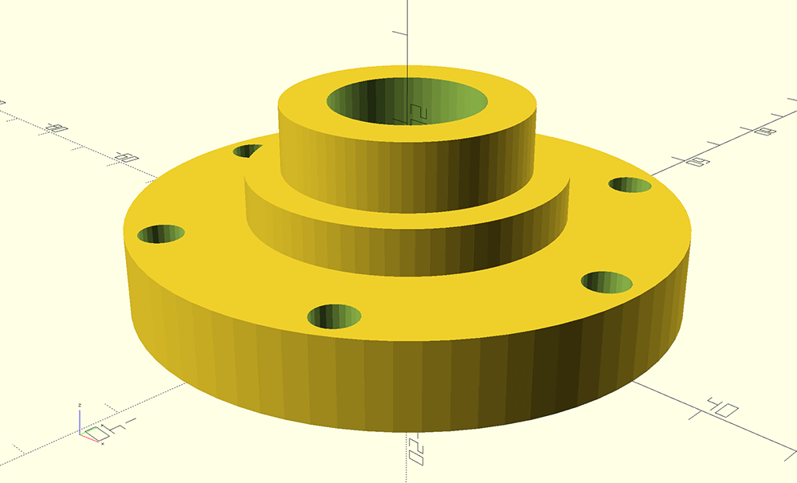
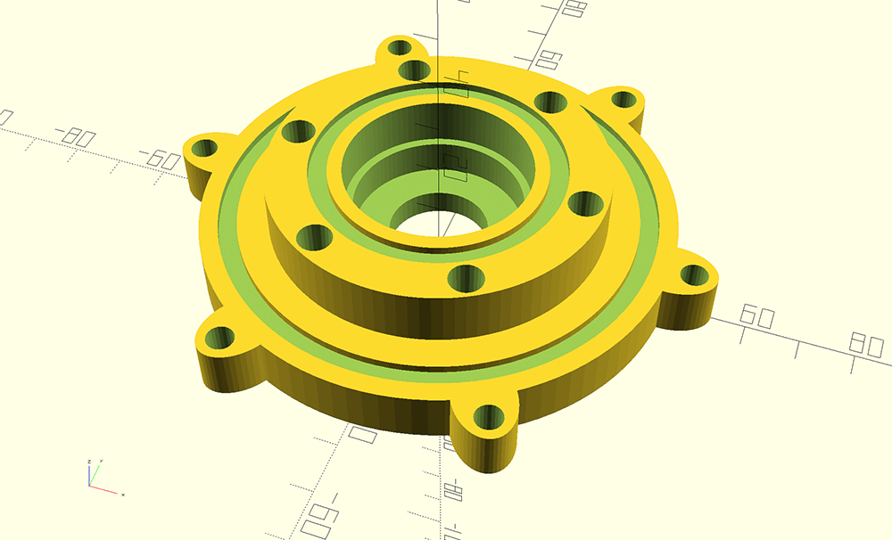

# WT400 3D Printed Parts

## Parts
|  | Part | 
| ----- | ---- | 
| | Runner |
| | Wheel |
| | Motor Cover |
| | Motor Mount |
| | Nose Cone Bottom |
| | Nose Cone Top |
| | Shroud |
| | Bearing Case Cover |
| | End Cap |

## Jigs

|  | Jig | 
| ----- | ---- |
| | bearing mount jig |
|| shaft hole jig |