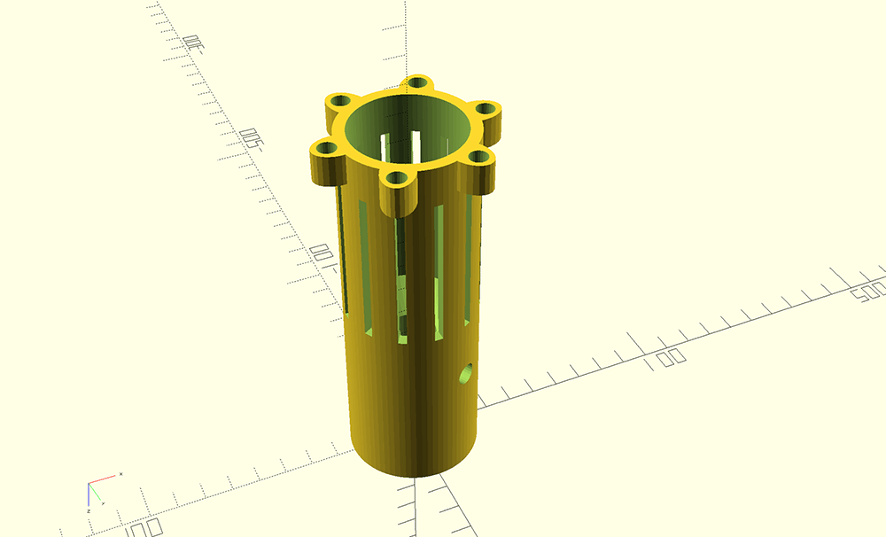
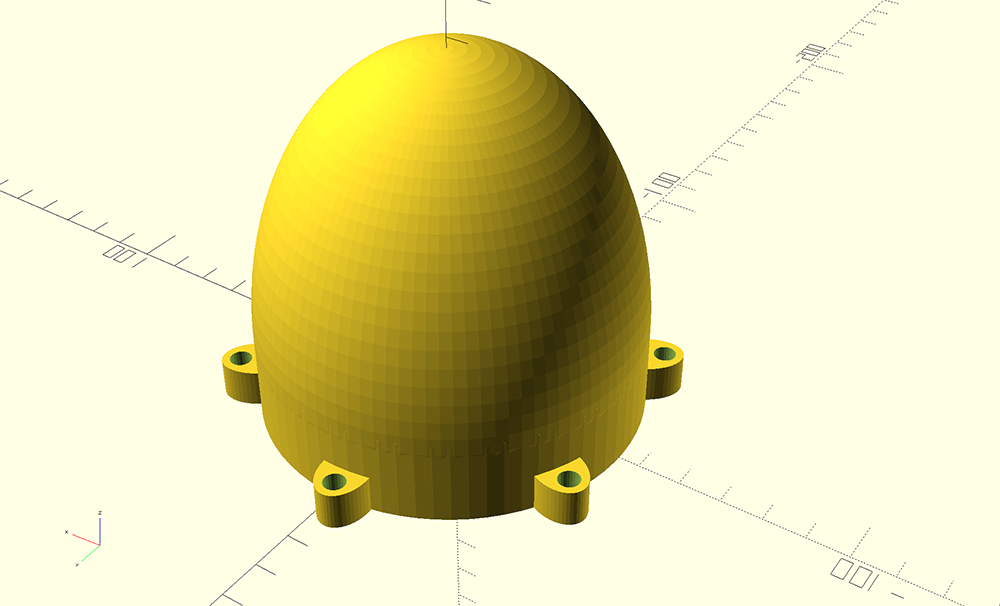

# WT400 3D Printed Parts

## Parts
|  Part | Closeup  | 
| ---- | ---- | 
| <a id="runner">Runner</a> |  |
| <a id="wheel">Wheel</a> |  |
| <a id="motor_cover">Motor Cover</a> |  |
| <a id="motor_mount">Motor Mount</a> |  |
| <a id="nose_cone_bottom">Nose Cone Bottom</a> |  |
|<a id="nose_cone_top">Nose Cone Top</a> |  |
| <a id="shroud">Shroud</a> |  |
| <a id="bearing_case_cover">Bearing Case Cover</a> |  |
| <a id="end_cap">End Cap</a> |  |
| <a id="bearing_mount_jig">Bearing Mount Jig</a> |  |
| <a id="shaft_hole_jig">Shaft Hole Jig</a> | |