| Name | Part | Where to buy | # Parts Required |
| --- | ----- | ---- | ---------------- |    
| <a id="grease_seal">Grease Seal</a> |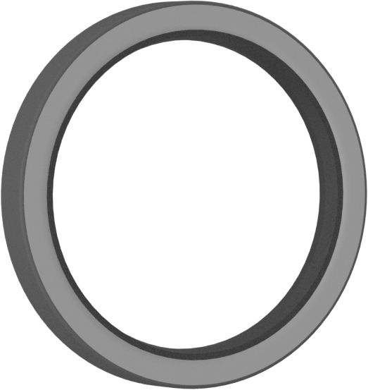|[Grease Seal for 5/8" Diameter Rotary Shaft](https://www.mcmaster.com/5154T83") | 2 |
| <a id="aluminum_round_tube">Shaft</a> |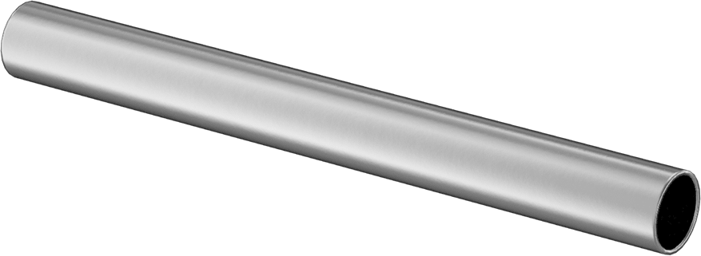|[6061 Aluminum Round Tube](https://www.mcmaster.com/9056K91") | 1 |	
| <a id="thrust_bearing">Thrust Bearing</a> |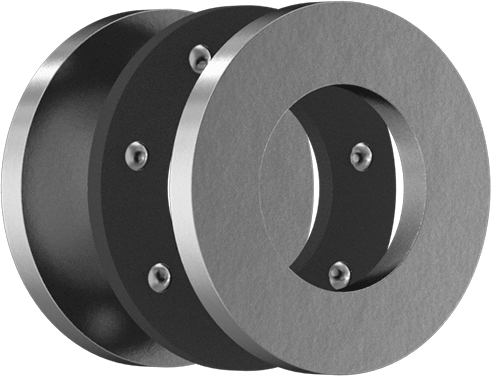| [Thrust Ball Bearing](https://www.mcmaster.com/6655K38") |	1 |	
| <a id="ball_bearing">Rotory Bearing</a> |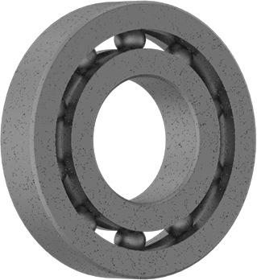|[Ball Bearing](https://www.mcmaster.com/60355K506") | 1 |
| <a id="hex_head_screw_1_1_2_inch">1-1/2" Hex Bolt</a> |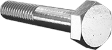|[18-8 Stainless Steel Hex Head Screw 1/4"-20 1-1/2"](https://www.mcmaster.com/92198a546") | 1 |
| <a id="carriage_bolt">Carriage Bolt</a> | 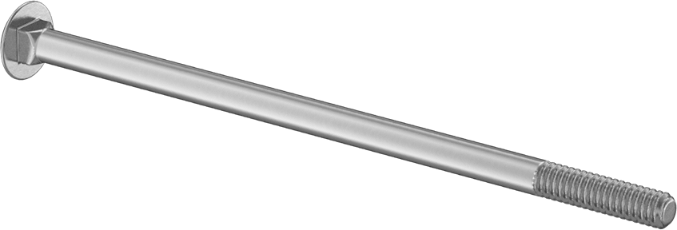|[18-8 Stainless Steel Square-Neck Carriage Bolt 1/4"-20 5-1/2"](https://www.mcmaster.com/92356A564") | 6 |
| <a id="screw_8_32_5_8">8-32 5/8" Hex Screw</a> | 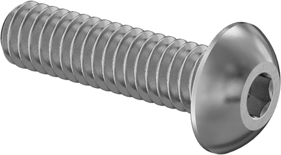|[18-8 Stainless Steel Button Head Hex Drive Screw 8-32 5/8"](https://www.mcmaster.com/92949A196") | 12 |
| <a id="screw_8_32_1_2">8-32 1/2" Hex Screw</a> ||[18-8 Stainless Steel Button Head Hex Drive Screw 8-32 1/2"](https://www.mcmaster.com/92196A194") | 12 |
| <a id="screw_4_40">4-40 3/4" Hex Screw</a> | 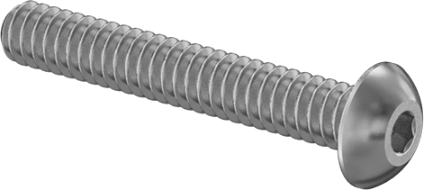|[18-8 Stainless Steel Button Head Hex Drive Screw 4-40 3/4"](https://www.mcmaster.com/92949A113") | 6	|
| <a id="M3_8mm_hex_screw">M3 8mm Hex Screw</a> |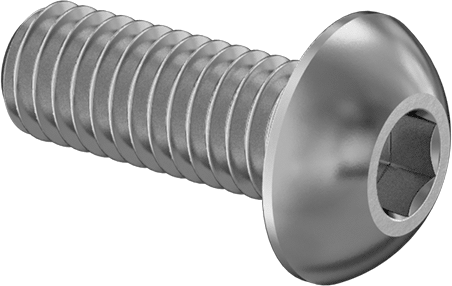|[18-8 Stainless Steel Button Head Hex Drive Screw M3 8mm](https://www.mcmaster.com/92095A181") | 6 |	
| <a id="screw_1_4_2">2" Hex Bolt</a> | 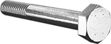|[18-8 Stainless Steel Hex Head Screw 1/4"-20 2"](https://www.mcmaster.com/92198A550") | 1 |	
| <a id="hex_nut">Hex Nut</a> | 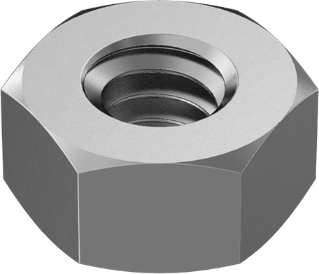|[18-8 Stainless Steel Hex Nut 1/4"-20](https://www.mcmaster.com/91845A029") | 10 |	
| <a id="washer">Washer</a> |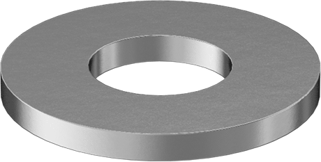|[18-8 Stainless Steel Washer for 1/4" Screw Size, 0.281" ID, 0.625" OD](https://www.mcmaster.com/92141A029") | 10 |	
| <a id="heatset_inserts">Heat-Set Inserts</a> | 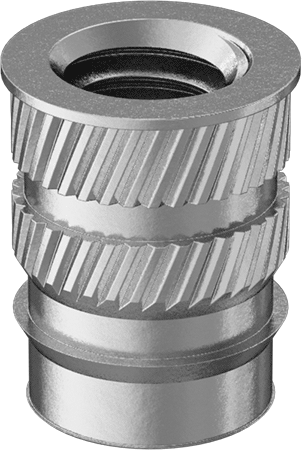|[Heat-Set Inserts for Plastics 8-32](https://www.mcmaster.com/93365A142") | 24 |	
| <a id="spring">Spring</a> |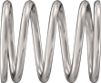|[Compression Spring 1" Long, 0.845" OD](https://www.mcmaster.com/9657K319") | 1 |	
| <a id="orings_3">3 1/4" O-Ring</a> |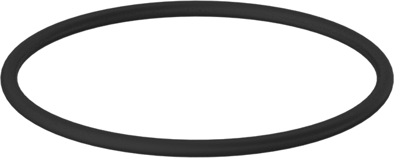|[Oil-Resistant Soft Buna-N O-Rings 3 1/4 OD](https://www.mcmaster.com/2418T189") | 2 |	
| <a id="1_7_8_oring">1 7/8" O-Ring</a> |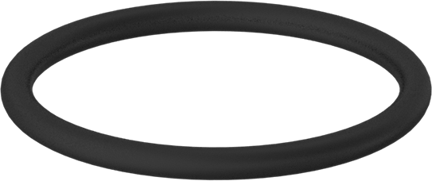|[Oil-Resistant Soft Buna-N O-Rings 1 7/8 OD](https://www.mcmaster.com/2418T178") | 1 |	
| <a id="motor">Motor</a> | 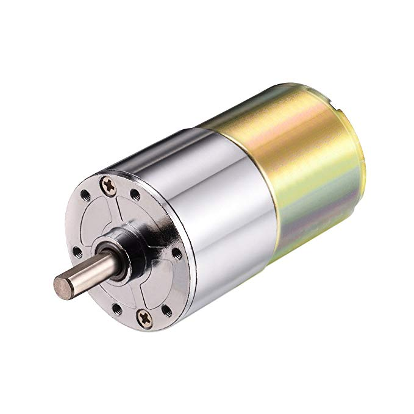|[uxcell 12V DC 200 RPM Gear Motor](https://www.amazon.com/gp/product/B01KTXRB90/?ie=UTF8&psc=1&tag=walrusturbine-20") | 1 |	
| <a id="hub">Motor Mounting Hub</a> |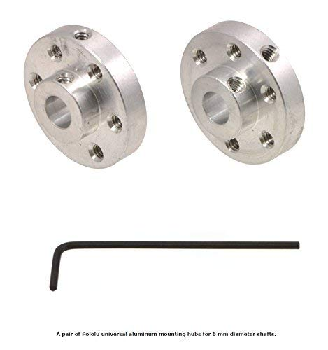|[Pololu 1083 UNIVERSAL ALUMINUM MOUNTING HUB](https://www.amazon.com/gp/product/B00B887FX8/?ie=UTF8&psc=1&tag=walrusturbine-20") | 1 |	
| <a id="eye_bolt">Eyebolt</a> | 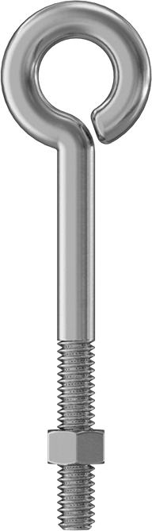|[Routing Eyebolt with Nut 1/4"-20 Thread, 2-1/2" Shank](https://www.mcmaster.com/9489t21) | 2  
| <a id="wire">Speaker Wire</a> ||[AmazonBasics 16-Gauge Speaker Wire - 100 Feet](https://www.amazon.com/gp/product/B006LW0W5Y/?ie=UTF8&psc=1&tag=walrusturbine-20") | 1 |	
| <a id="pla">PLA</a> | 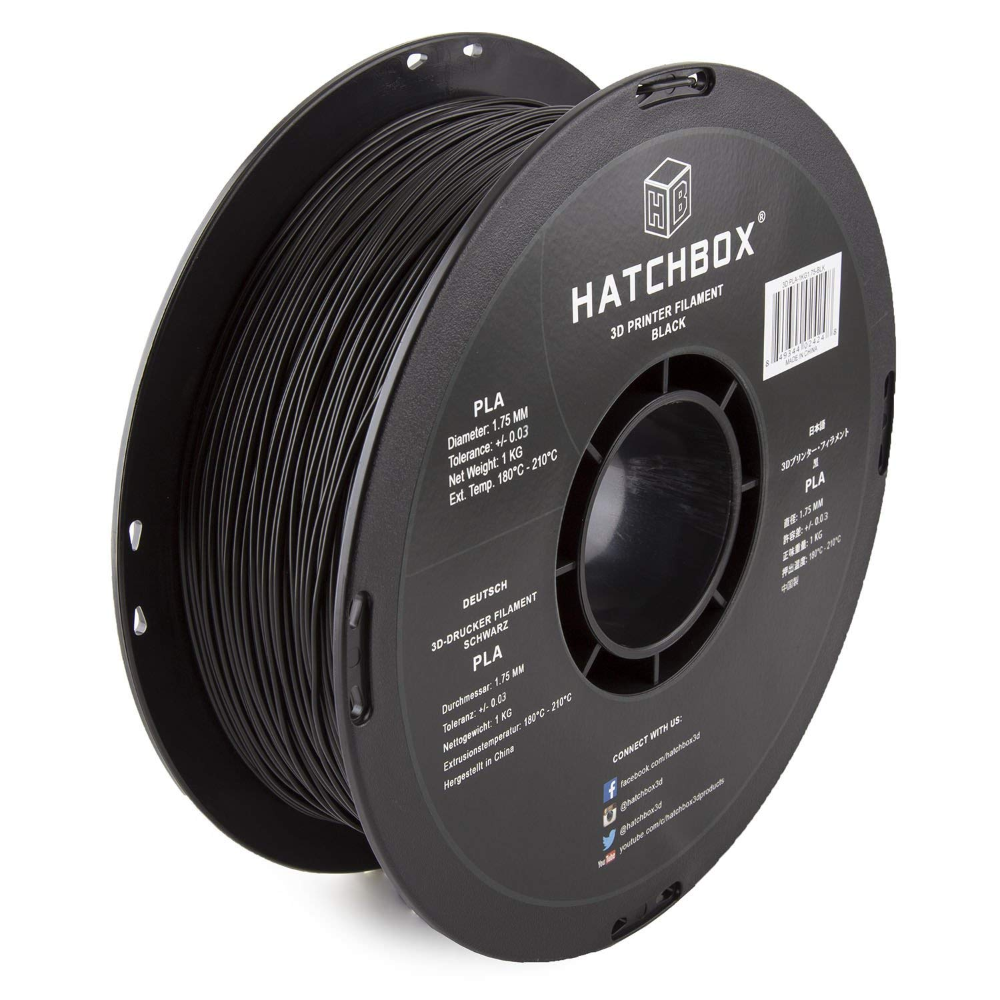|[HATCHBOX PLA 3D Printer Filament, 1 kg Spool, 1.75 mm](https://www.amazon.com/HATCHBOX-3D-Filament-Dimensional-Accuracy/dp/B00J0ECR5I/?ie=UTF8&psc=1&tag=walrusturbine-20") | 4 |	
| <a id="grease">Grease</a> |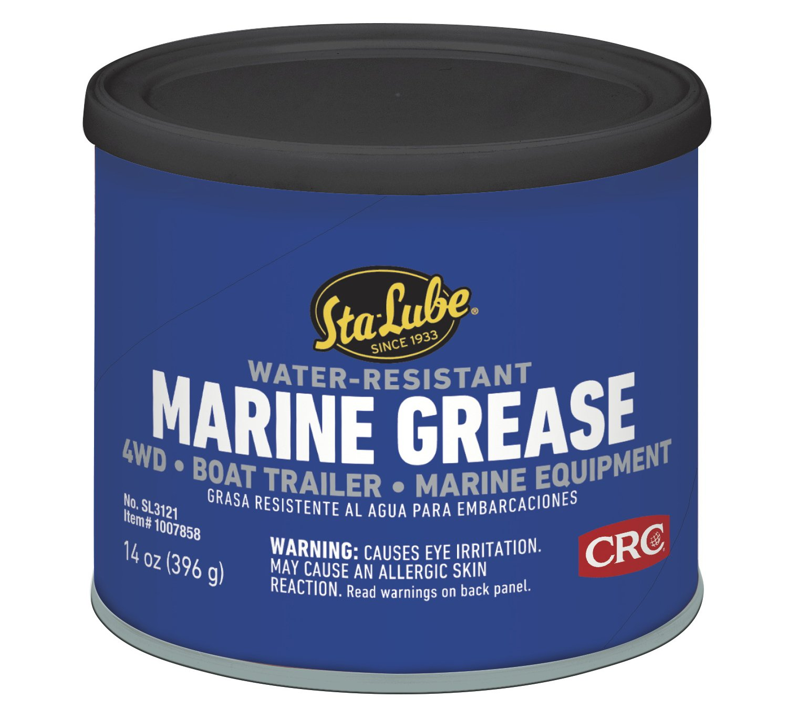|[CRC SL3121 Marine Boat Trailer and 4 x 4 Wheel Bearing Grease - 14 wt. oz.](https://www.amazon.com/gp/product/B000CPJMY8/?ie=UTF8&psc=1&tag=walrusturbine-20") | 1 |	
| <a id="spray">Clear Glaze</a> |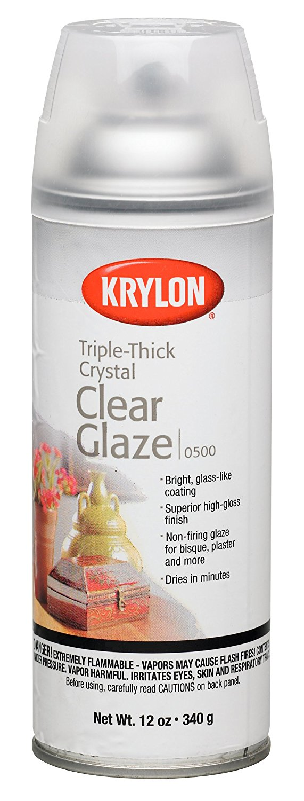|[Krylon I00500A00 12-Ounce Triple Thick Clear Glaze Aerosol Spray](https://www.amazon.com/gp/product/B001144TJC/?ie=UTF8&psc=1&tag=walrusturbine-20") | 1 |	
| <a id="masking_tape">Masking Tape</a> |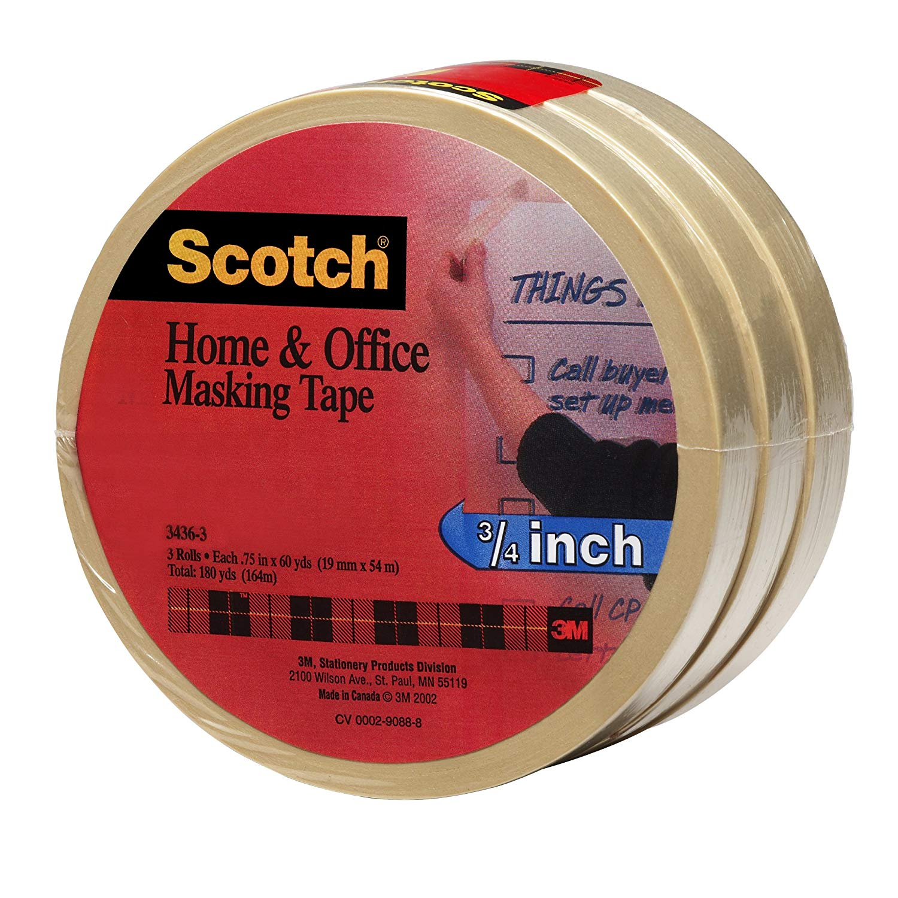| [Scotch(R) Home and Office Masking Tape 3436-3, 3/4-inch x 54.6 Yards, 3 Pack](https://www.amazon.com/Scotch-Office-Masking-3436-3-4-inch/dp/B00347A8E4/?ie=UTF8&psc=1&tag=walrusturbine-20") | 1 |
| <a id="loctite">Loctite</a> | 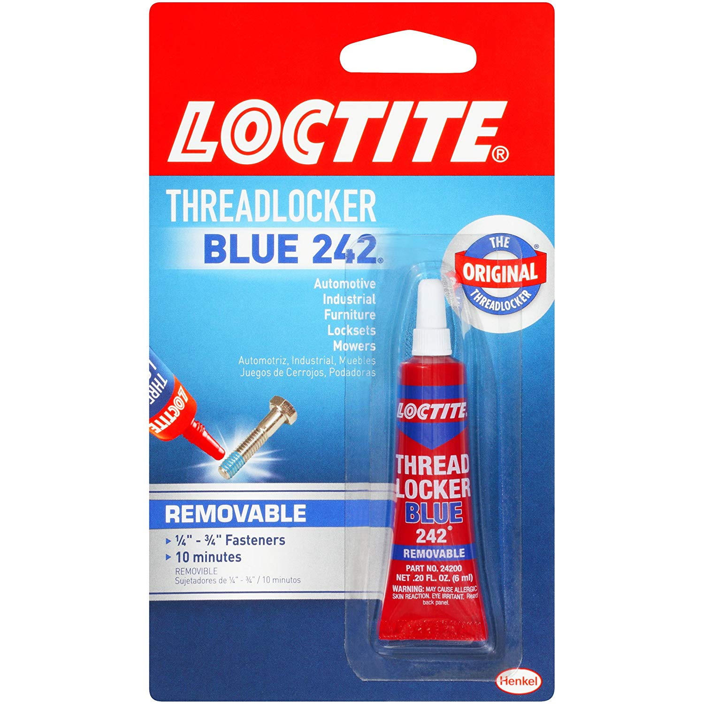| [Loctite Heavy Duty Threadlocker, 0.2 oz, Blue 242, Single](https://www.amazon.com/Loctite-Heavy-Duty-Threadlocker-Single/dp/B000I1RSNS/?ie=UTF8&psc=1&tag=walrusturbine-20") | 1 |
| <a id="caulk">Caulk</a> |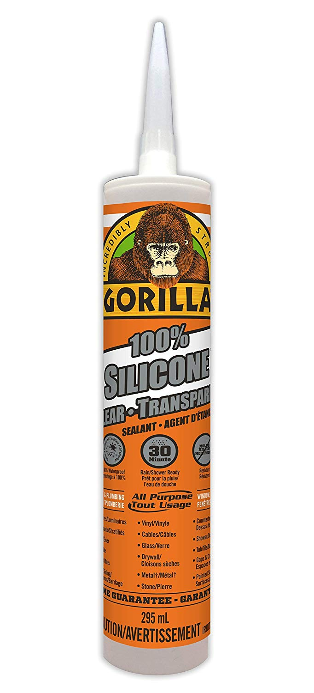| [Gorilla Clear 100 Percent Silicone Sealant Caulk, Waterproof and Mold & Mildew Resistant, 10 ounce Cartridge, Clear, (Pack of 1)](https://www.amazon.com/Gorilla-Silicone-Waterproof-Resistant-Cartridge/dp/B01MQW8AEM/?ie=UTF8&psc=1&tag=walrusturbine-20") | 1 |