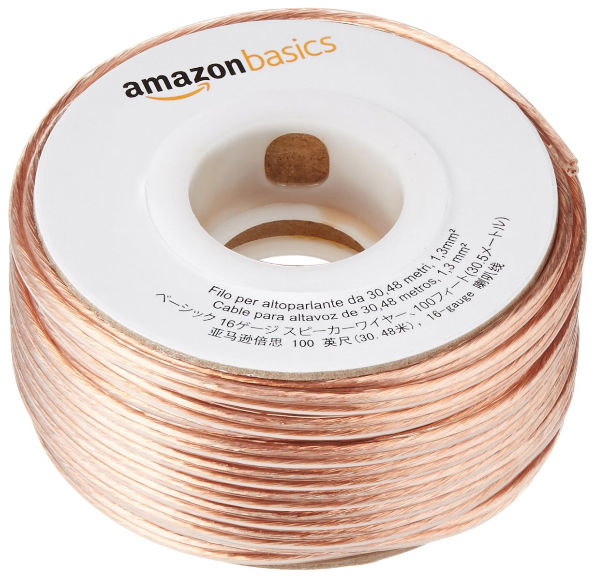

| image | Part | # Parts Required |
| ----- | ---- | ---------------- |    
||[Grease Seal for 5/8" Diameter Rotary Shaft](https://www.mcmaster.com/5154T83) | 2 |
||[6061 Aluminum Round Tube](https://www.mcmaster.com/9056K91) | 1 |	
||[Thrust Ball Bearing](https://www.mcmaster.com/6655K38) |	1 |	
||[Ball Bearing](https://www.mcmaster.com/60355K506) | 1 |
||[18-8 Stainless Steel Hex Head Screw 1/4"-20 1-1/2"](https://www.mcmaster.com/92198a546) | 1	 |
||[18-8 Stainless Steel Square-Neck Carriage Bolt 1/4"-20 5-1/2"](https://www.mcmaster.com/92356A564) | 6 |
||[18-8 Stainless Steel Button Head Hex Drive Screw 8-32 5/8"](https://www.mcmaster.com/92949A196) | 12 |
||[18-8 Stainless Steel Button Head Hex Drive Screw 8-32 1/2"](https://www.mcmaster.com/92196A194) | 12 |
||[18-8 Stainless Steel Button Head Hex Drive Screw 4-40 3/4"](https://www.mcmaster.com/92949A113) | 6	|
||[18-8 Stainless Steel Button Head Hex Drive Screw M3 8mm](https://www.mcmaster.com/92095A181) | 6 |	
||[18-8 Stainless Steel Hex Head Screw 1/4"-20 2"](https://www.mcmaster.com/92198A550) | 1 |	
||[18-8 Stainless Steel Hex Nut 1/4"-20](https://www.mcmaster.com/91845A029) | 10 |	
||[18-8 Stainless Steel Washer for 1/4" Screw Size, 0.281" ID, 0.625" OD](https://www.mcmaster.com/92141A029) | 10 |	
||[Heat-Set Inserts for Plastics 8-32](https://www.mcmaster.com/93365A142) | 24 |	
||[Compression Spring 1" Long, 0.845" OD](https://www.mcmaster.com/9657K319) | 1 |	
||[Oil-Resistant Soft Buna-N O-Rings 3 1/4 OD](https://www.mcmaster.com/2418T189) | 2 |	
||[Oil-Resistant Soft Buna-N O-Rings 1 7/8 OD](https://www.mcmaster.com/2418T178) | 1 |	
||[uxcell 12V DC 200 RPM Gear Motor](https://www.amazon.com/gp/product/B01KTXRB90/?ie=UTF8&psc=1&tag=walrusturbine-20) | 1 |	
||[Pololu 1083 UNIVERSAL ALUMINUM MOUNTING HUB](https://www.amazon.com/gp/product/B00B887FX8/?ie=UTF8&psc=1&tag=walrusturbine-20) | 1 |	
||Routing Eyebolt with Nut | 2  
||[AmazonBasics 16-Gauge Speaker Wire - 100 Feet](https://www.amazon.com/gp/product/B006LW0W5Y/?ie=UTF8&psc=1&tag=walrusturbine-20) | 1 |	
||PLA Filament 1KG | 4 |	
||[CRC SL3121 Marine Boat Trailer and 4 x 4 Wheel Bearing Grease - 14 wt. oz.](https://www.amazon.com/gp/product/B000CPJMY8/?ie=UTF8&psc=1&tag=walrusturbine-20) | 1 |	
||[Krylon I00500A00 12-Ounce Triple Thick Clear Glaze Aerosol Spray](https://www.amazon.com/gp/product/B001144TJC/?ie=UTF8&psc=1&tag=walrusturbine-20) | 1 |	
| | [Masking Tape](https://www.amazon.com/Scotch-Office-Masking-3436-3-4-inch/dp/B00347A8E4/?ie=UTF8&psc=1&tag=walrusturbine-20) | 1 |
| | [Loctite](https://www.amazon.com/Loctite-Heavy-Duty-Threadlocker-Single/dp/B000I1RSNS/?ie=UTF8&psc=1&tag=walrusturbine-20) | 1 |
|| [Caulk](https://www.amazon.com/Gorilla-Silicone-Waterproof-Resistant-Cartridge/dp/B01MQW8AEM/ref=sr_1_3?crid=2PK8CL0THAEGX&keywords=caulk&qid=1554775185&s=gateway&sprefix=caulk%2Caps%2C203&sr=8-3) | 1 |