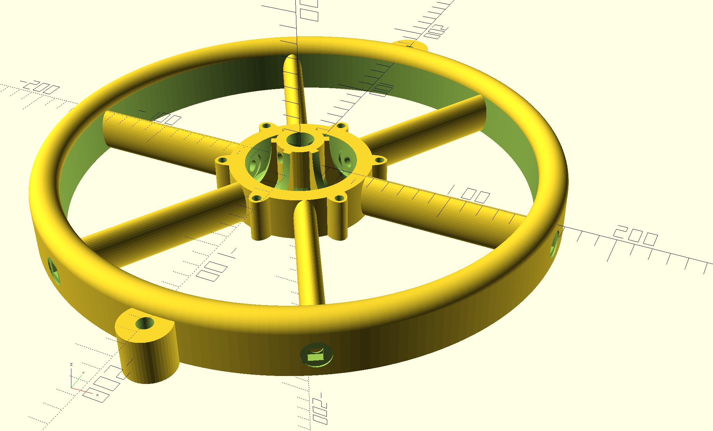
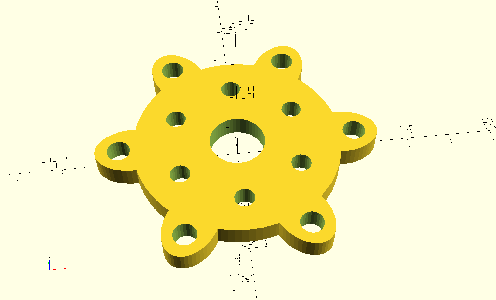
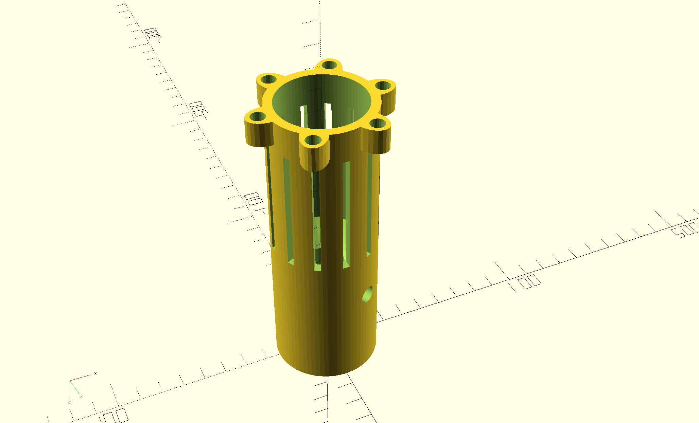
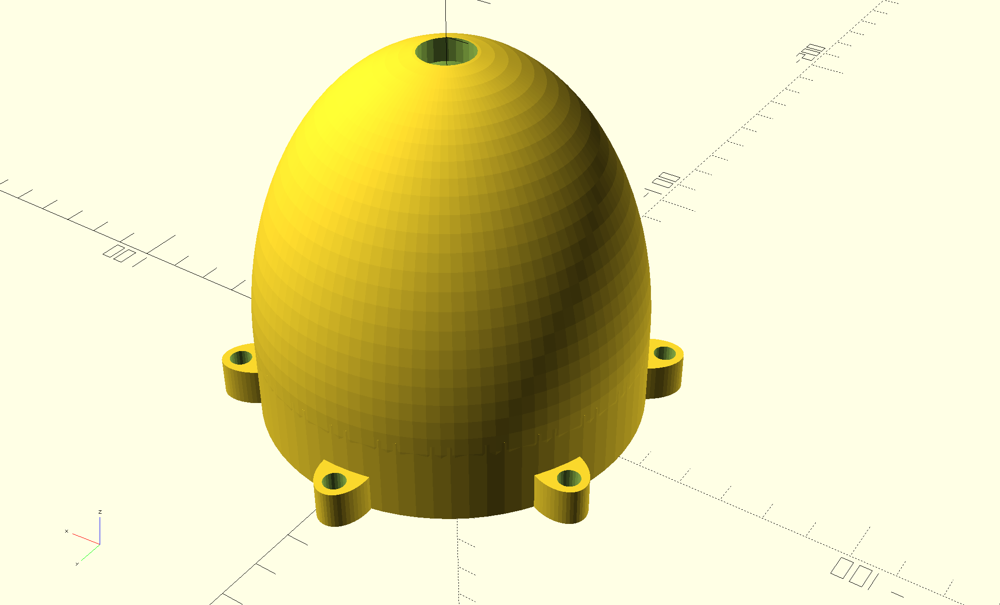
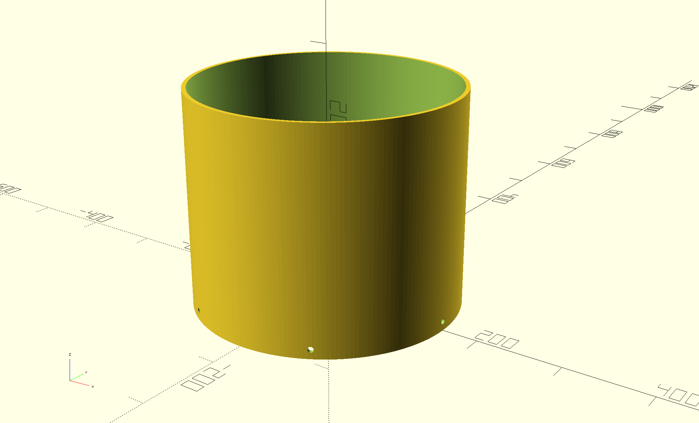
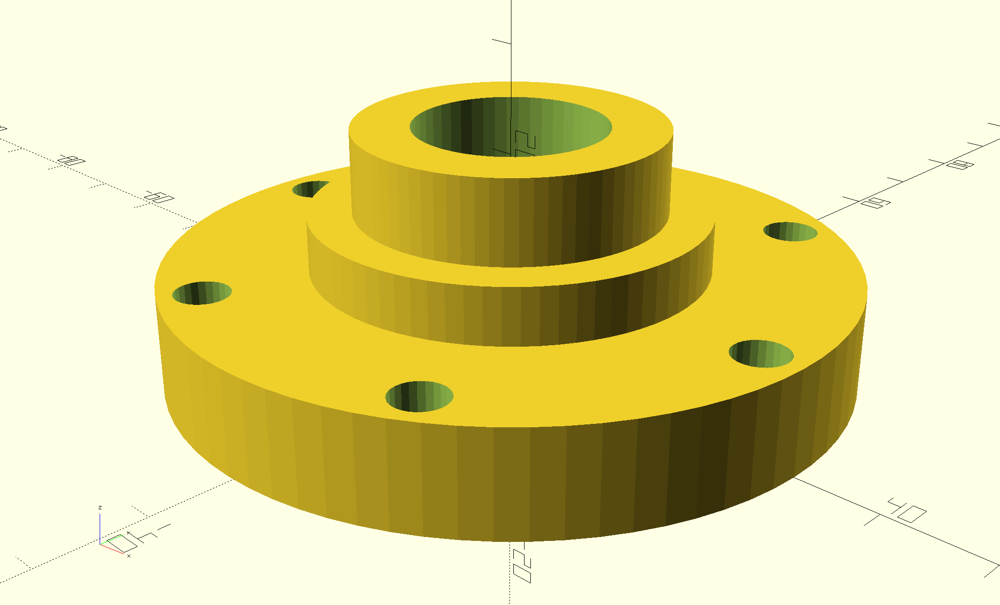
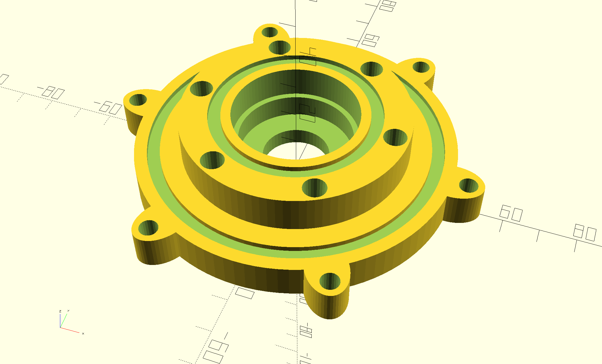

# Walrus Turbine 400 Assembly Instructions

## 3D Printed Parts
         
## Steps
1. Parts Prep
    1. Drill out bolt holes with 3/16 drill bit.
    2. Drill out motor mount holes in motor cover with 
    3. Spray all parts (2 coats) with clear glaze.
    4. Install heat-set inserts
        1. Install 6 heat-set inserts in top of runner.
        2. Install 6 heat-set inserts in bottom of runner.
        3. Install 6 heat-set inserts in motor mount.
        4. Install 6 heat-set inserts in wheel.
2. Center Shaft Assembly
    1. Drill ¼” holes in shaft 12mm on center from each end.
    2. Be sure to remove any burrs from hole.
    3. Mount rotary bearing on shaft 79mm from end to top of bearing.
    4. Cover ends of shaft with tape.
3. End Cap Assembly
    1. Mount grease seal in end cap and bearing cap.
    2. Apply grease to inside surfaces of both parts including o-ring grooves.
    3. Be sure to fill empty space between both seals and the bearing with grease.  
    4. Insert rotary seal and shaft into end cap. 
    5. Insert o-ring into groove on end cap.
    6. Mount bearing cap onto shaft.
    7. Secure bearing cap to end cap with 6 8-32 ⅝” button head hex drive screws.
4. End Cap Install
    1. Slide thrust bearing onto shaft below bearing case.
    2. Grease between each layer of thrust bearing.
    3. Place o-ring in groove on end cap.
    4. Put Spring in top of motor mount.
    5. Slide motor mount onto shaft, compressing spring until hole in shaft and motor-mount align.  Then insert ¼-20 2” hex-head bolt through hole in motor mount and shaft.  Secure with ¼” nut.  
5. Mouting Motor
    1. Mount motor cover on motor using 6 M3 x 6mm button head hex drive screws.
    2. Mount 6mm motor hub onto motor shaft with two grub screws
    3. Dap each grub screw hole with loctite before inserting.
    4. Slide speaker wire down shaft starting at end cap and exiting out motor mount.
    5. Solder speaker wire to motor leads.
    6. Insert motor into motor-mount and secure motor-cap to the motor-mount with 6 8-32 ½” button head hex drive screws.
6. Runner Assembly
    1. Grease runner top o-ring groove.
    2. Place motor-mount / end cap assembly inside runner.
    3. Align motor hub with holes in bottom of runner and secure with 6 4-40 ¾” button head hex drive screws.
    4. Secure end cap to runner with 6 8-32 ⅝” button head hex drive screws.
    5. Wipe up excess grease.
7. Bottom Cone Assembly
    1. Grease runner bottom o-ring groove and install o-ring.
    2. Grease bottom cone o-ring groove and secure to runner with 6 8-32 ½” button head hex drive screws.
    3. Wipe up excess grease. 
8. Wheel Assembly
    1. Feed speaker wire through center of wheel.
    2. Insert shaft through center of wheel and align hole in shaft to with hole in wheel shaft lock. 
    3. Insert ¼-20 1 ½” hex head bolt through hole in wheel shaft lock and shaft and secure with ¼” nut.
    4. Insert shroud into slot on underside of wheel and align shroud holes to wheel spoke holes.
    5. Insert ¼-20 5 ½” carriage bolts into spoke holes and secure with ¼” washer and nut.
    6. Fill around speaker wire in top of shaft with hot glue and let cool for 5 minutes.
    7. Secure top cone to wheel using 6 8-32 ½” button head hex drive screws.
    8. Fill around speaker wire in top cone hole with hot glue.
